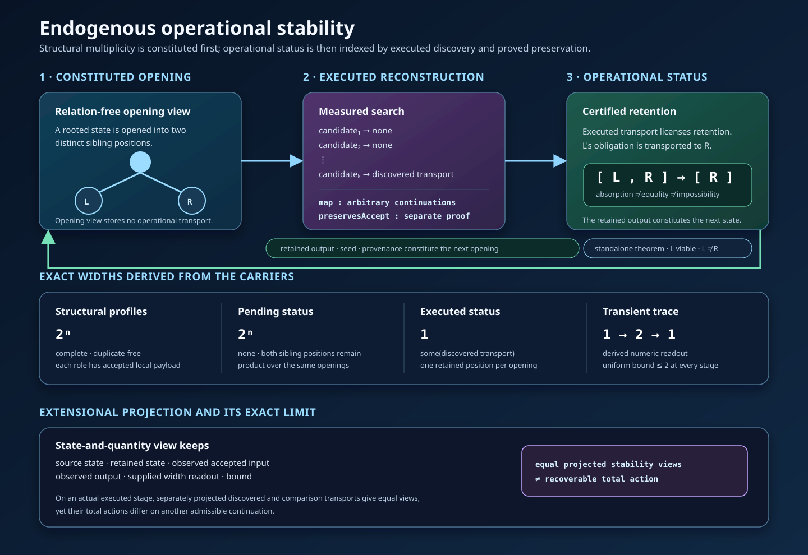
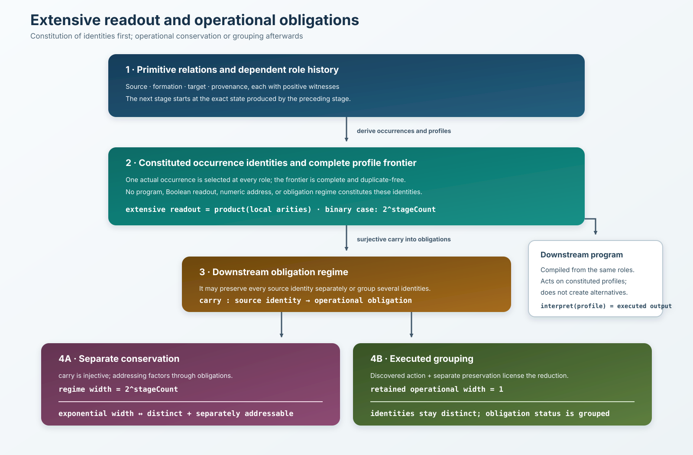

## Foreword

*Mathematicians now have, with Lean, a proof tool precise enough to compare not
only the results proved, but the meanings that proofs acquire according to the
formal ontologies in which they are situated.*

*`Relational Perimeter` puts this possibility to the test by treating relations
as primitives of formal constitution. From this choice, it re-examines the
meanings of familiar notions such as role, perimeter, circularity, closure,
whole, residual, transport, and turning. It follows their constitution in the
types: which relations are primitive, which witnesses are given, which
occurrences are generated, which relations are preserved by transports, and
which data are actually consumed by proofs.*

*In this sense, the framework is endogenous relative to the primitive
presentation it receives. It does not generate its own primitives; within a
single typed architecture, it constructs or establishes the identities, roles,
histories, exact quantity of the perimeter, and changes of status that proceed
from them.*

*The carrier, understood as the formal support equipped with its structure, is
not neutral. In the four-node example, separating models show that local data
alone determine neither order nor participation in the whole. For every
presentation, returning to a rooted, composable history then makes it possible
to reconstruct order, adjacency, and factorization from the global constitution
of the object.*

*The scope of this formalization goes beyond a mere terminological refinement.
By stratifying construction, realization, admission, and satisfaction of a
specification, it shifts the very criteria of identity and completeness. An
occurrence receives its identity from the relational history that constitutes
it, not from its value alone. A whole is complete when its relations positively
determine its interior domain, not when it exhausts every possible continuation.
What might appear as incompleteness then becomes the non-exhaustion of
generation. The affirmative perimetral turning designates the exact point at
which, beyond an already constituted and complete whole, generation produces a
continuation outside the regime in which that whole is maximal.*

*The perimeter thus determines an exact quantity whose exactness does not
depend on numerical evaluation. This quantity is carried by the reversible
correspondence between the successive positions and the occurrences of the
deployment; their order and adjacency are established by distinct structural
relations. The closing place completes the circular system of requirements
without entering this interior quantity, since it is not generated as an
occurrence. `History.length` provides only a subsequent, derived numerical
reading of it.*

*The methodological distinction between theorem and chain extends this
stratification without opposing them as two unrelated terms. The theorem
expresses a terminal propositional result; the chain retains the relations,
witnesses, provenances, and typed dependencies within which its proof acquires
its meaning. The same theorem may be situated in different constitutive chains;
conversely, a chain may carry more structure than the theorem's minimal logical
proof actually consumes. Comparison therefore holds together what proofs
establish and the relational constitution within which they establish it.*

*This approach makes comparable what terminal theorems alone leave invisible.
Two systems may establish similar propositional results while giving objects
and proofs different relational constitutions, and therefore different
meanings. The relational constitution of the perimeter, circularity, and the
affirmative perimetral turning provide the formal setting in which this method
is deployed.*

<br>

# Relational Perimeter

**Primitive relations, constituted wholes, and affirmative perimetral turning in Lean**

This repository contains a constructive Lean formalization in which relations
are part of the constitution of formal objects rather than annotations added
afterwards. A single proof-relevant family,
`Compatible : Implicit → Explicit → Type`, occurs in three distinct positions:
inside each node, between successive nodes, and at the distinguished closing
pair.

The formalization separates:

- given relational witnesses from the generated occurrences that realize them;
- the constituted perimeter from the primitive closing junction;
- relational closure from node identity, pole identification, and periodic
  return;
- residual determination from the proof-theoretic source of rejection;
- exact carrier transport from preservation of relational architecture;
- continued constitution from admission by the circular regime.

The resulting **affirmative perimetral turning** is the first generated step
beyond the constituted perimeter. It remains constructed, locally exact,
faithfully labelable in the unique residual role, and exactly interpretable,
while falling outside the preceding regime and specification.

The same relational method is extended to computation. The repository exhibits
a search whose **operational decomposition is produced by the computation**:
opening creates two structurally distinct alternatives, an executed search
reconstructs a directed transport between them, and a separate preservation
proof permits one obligation to be absorbed for the criterion under study.
Neither equality of the alternatives nor impossibility of the absorbed one is
asserted. The retained result and its provenance then condition the next
discovery. The public fused executor forms the local operational production at
the current stage before recursing from the state that stage produced; the
local production type has no future-history parameter.


The framework first constitutes each role occurrence through its positive
formation and provenance relations, then derives the complete profile carrier
on which the computation acts. For `n` binary openings the extensive readout
of this source has exact width `2^n`. A downstream regime has that full
exponential width exactly when it keeps the constituted profiles as distinct,
separately addressable obligations. For every source profile, the executed
normalizer constructs a target occurrence profile together with the exact
dependent trace that produces it. The transformed decision eliminates an
action-produced target whose private construction is indexed by a preserving
absorption witness. That witness consumes the reconstructed total action, its
exact output, the separate preservation proof, non-identity, and occurrence
distinction; the retained case consumes positive viability. The normalizer
recurses on the complete constitutive chain carrying those witnesses rather
than rebuilding targets from the retained output; its result is a derived
elimination of that chain, not a replaceable stored field. The operational
target carrier remains the full dependent product of the continuation spaces;
it is not restricted in advance to a singleton. The executed traces prove that
the produced targets converge. Each head production stores the full image
of its actual local output map. Its frontier removes duplicate local outputs,
with equality justified by the executed output agreement. The history composes
these images without enumerating all source profiles. A two-sided transport
realizes their actual values in the admitted image; its inverse copies those
values rather than selecting a fixed source occurrence. Completeness and
duplicate-freedom follow from the return laws before numerical width is read.
Separately, an `ExecutedOperationalGroupingAuthorization` is projected
from the complete causal chain and therefore retains its preservation and
occurrence-separation witnesses. `ExactExecutedOperationalRegime` joins this
authorization to the exact target-image realization; it does not identify
realization with admission. Obligation equality is exactly equality of
produced targets and exactly codetermination by two authorized executed traces;
width one follows local output convergence and the exact transport. The traces
prove agreement with the same actual outputs. Two explicit source profiles are
proved distinct while being carried together. No source profiles are
identified.

A state-and-quantity projection preserves the observed states, output, width
readout, and bound, but does not determine the total operational action. At the
generic level, `ActionFactorsThrough` expresses recoverability of a total
action from a projection, while `AnchoredActionProjectionCollision` records
equal projected values whose total actions differ at one argument and fixes
its first preimage in the witness type. On the
actual executed generated system, the total transport stored by the
authoritative instruction and a comparison transport instantiate this
collision: their separately constructed views are equal, they agree at the
observed executed continuation, and their total actions differ on another
admissible continuation. The instruction acts pointwise as the discovered
relation on every continuation. The public collision theorem mentions that
authoritative instruction explicitly in its conclusion. In this exact sense,
the specified state-and-quantity view is a forgetful projection of the
constituted operational process.



The repository now proves the extensive equivalence at the level of a general
relational class. Primitive source, formation, target, and provenance relations
constitute a dependent history of role occurrences. Its source carrier is made
of `RelationallyConstitutedOccurrence` values: each selected occurrence is
indexed by its constituting relational stage, from which its exact formation
and provenance witnesses are recovered in `Type`. Complete occurrence profiles
are derived from that history before any program or operational regime. Their
width is the product of the realized local arities; uniform
binary histories therefore have exact width `2^n`. The class is unbounded and
has an inhabitant independent of the public SAT execution; the wider class also
contains variable-arity histories.

An operational regime may preserve those profile identities as distinct
obligations or group them. Lean proves, for every problem in every binary
relational family formalized by the class:

```text
regime width = 2^stageCount
  ↔ constituted identities remain distinct and separately addressable
     through that regime.
```

The same condition is equivalent to exact minimum addressing capacity
factorized through the regime. On the public carrier, the certificate
constructs the full-width identity regime and positively proves its complete
conservation condition. On the same constituted identities, the executed
normalizer produces one full typed operational target and one exact trace for
each source profile. These traces come from the stagewise decomposition whose
head is produced from the current executed stage before any future tail. The
normalizer consumes a dependent constitutive chain whose every link exposes
the authoritative relational action, exact output, separate preservation,
viability, non-identity, and persistent occurrence distinction.
The complete source-indexed family of produced targets and traces is exposed
before the operational regime. Preservation and persistent occurrence
separation are projected from the complete causal chain into the grouping
authorization. The traces separately prove convergence. Each local output
image is stored by the head producer; `publicExecutedOutputPolicy` composes
those images. `policyObligationTransport` connects their actual values to the
admitted obligations with two return laws and source-wise carry and action
agreements. `publicRegimeWidth_eq_producedOutputs` relates the admitted width
to that output policy. Its values remain the actual produced targets.
The fused causal run and its role history are proved equal to the authoritative
public realization. The general class and the executed instance use the same
occurrence-profile carrier definitionally, so the class theorem is stated
directly on the authoritative executed carrier. Two explicit source profiles are
proved distinct, codetermined by their traces, and carried together. The regime
therefore has width one and fails separate preservation without equating any
source profiles. A separate public theorem states the literal exponential
`iff` directly on this role-profile carrier.



This is a theorem about exact carrier width and factorized finite addressing in
the formalized class, not a universal time or memory lower bound. The audited
state-and-quantity projection and instrumented execution costs remain distinct
downstream results.

## Positioning and scope


`Relational Perimeter` is a relational architecture formalized in dependent
type theory in Lean, not a competing logical foundation. Its constitutive
primitive relations, generated histories, exact realizations, interpretations,
regimes, and specifications remain separate interfaces. In particular, a
continuation may be positively generated, equipped with an exact concrete
realization, faithfully classified by its unique residual place, and
structurally interpreted without being admitted to the circular regime or
satisfying the circular specification.

The canonical positioning statement, its limits, and the primary references
for the external comparisons are available in the parallel versions listed
below.

## Documents

- [English presentation](docs/primitive-relations-and-perimeter-constitution.en.md)
- [Présentation française](docs/relations-primitives-constitution-perimetre.fr.md)
- [Positioning and scope](docs/positioning-and-scope.en.md)
- [Positionnement et portée](docs/positionnement-et-portee.fr.md)
- [Endogenous operational decomposition](docs/endogenous-operational-decomposition.en.md)
- [Décomposition opérationnelle endogène](docs/decomposition-operationnelle-endogene.fr.md)
- [Variable executed decomposition](docs/variable-executed-decomposition.en.md)
- [Décomposition exécutée variable](docs/decomposition-executee-variable.fr.md)
- [Conceptual authorship and AI-generation disclosure](AI_AUTHORSHIP.md)

## Foundational Lean sources

- `SegmentedResidualRole.lean`: abstract residual-role determination;
- `AbstractSegmentedTurning.lean`: abstract boundary, continuation, and regime
  turning;
- `ExactTypeTransport.lean`: constructive two-sided transport between types;
- `StrongPerimetralTurning.lean`: the constructive circular presentation and
  its perimetral instance.

## Computational construction

- `RelationalPerimeter/Computation/ConstitutiveGeneration.lean` connects the
  computation directly to the generated histories of the four foundational
  modules;
- `RelationalPerimeter/Computation/EndogenousOperationalDecomposition.lean` is
  the public statement layer for the computational phenomenon;
- `RelationalPerimeter/Computation/ConstitutiveSearch/` contains the complete
  executable construction, its relational transports, SAT instance, feedback
  recursion, and production-level measured accounting;
- `PrefixLocalOperationalProduction.lean`,
  `ExecutedRoleIndexedReduction.lean`, `ExecutedCausalNormalization.lean`, and
  `ExactOperationalImage.lean` construct the stage-only production interface
  and the source-indexed executed traces,
  prove convergence of their produced targets, and derive the operational
  regime while retaining those actual target values;
- `Tests/ComputationalPhenomenonRegression.lean` protects the production
  statements corresponding to the independently enumerated adversarial probes,
  including the production seed and the causal connection between measured
  initialization and the first threaded state;
- `Tests/ConstitutiveExecutionRegression.lean` protects the complete executed
  and measured surface;
- `Tests/EndogenousOperationalStabilityRegression.lean` protects the exact
  structural, pending, executed, and transient widths together with the causal
  map, measured-failure, wrong-singleton, and non-factorization boundaries. In
  particular, it checks the public `ActionFactorsThrough` statement and a
  generic projection collision whose equality is propositional rather than
  definitional.
- `Tests/RelationalExtensiveIffRegression.lean` protects the class-level
  exponential `iff`, its exact factorized-capacity form, the independent
  unbounded members of the relational classes, and the one-chain public
  normalization from typed action outputs and source-indexed traces to the
  exactly realized operational image.

The computational tree imports the foundational modules directly. It has no
dependency on an external alignment layer, a separate foundation layer, or a
readout facade.

## Build

The repository pins Lean 4.33.1 and has no Mathlib dependency.

```text
lake build
```

The complete repository gate is available on both supported command surfaces:

```text
pwsh -NoProfile -File scripts/verify.ps1
bash scripts/verify.sh
```

Both gates traverse the declared import boundaries, build the library, and
then compile all 19 expected-failure fixtures listed in the shared
`scripts/expected-failures.tsv` inventory. Unlisted, missing or duplicate fixtures
fail both gates. Privacy, dependent-type, semantic-type and termination tests
are reported separately; a termination rejection is not a general causality
proof. `python3 scripts/test-expected-failure-gates.py --output /tmp/gate-tests`
exercises both gates after the build (PowerShell is required). These fixtures verify that the scientific
certificate and causal-regime constructors remain private, that profiles from
distinct stored instructions are not directly interchangeable, that a retained
decision cannot replace the transformed decision, that the projection
collision remains indexed by the authoritative instruction transport, and
that an interpreter which ignores an arbitrary raw instruction cannot satisfy
its semantic output specification.

All Lean sources are constructive: they contain no `sorry`, `axiom`, or
`noncomputable` declaration, and their final axiom-audit blocks report no axiom
dependency for the audited declarations. The default build includes the public
modules and the regression suites.

## Résumé français

Ce dépôt formalise en Lean une architecture constructive où les relations sont
primitives et participent à la constitution des objets, des occurrences et des
chaînes. Le périmètre est l'histoire enracinée et composable qui réalise les
jonctions successives données. La jonction fermante reste primitive et n'est
pas parcourue par la génération. Le premier pas au-delà du périmètre constitue
un tournant périmétral affirmatif : la génération continue, tandis que
l'incorporation de cette continuation dans le même régime devient impossible.

Cette architecture porte aussi une décomposition opérationnelle endogène de la
recherche. L’ouverture produit une multiplicité structurelle ; une relation
dirigée est ensuite reconstruite par l’exécution, sa préservation est prouvée
séparément, et le résultat retenu conditionne la découverte suivante. La même
récursion forme la production opérationnelle de l’étape courante avant de
poursuivre depuis l’état produit. Ainsi, le nombre d’alternatives engendrées et
le nombre d’obligations qui doivent rester indépendantes ne sont pas confondus.

Pour `n` ouvertures binaires exécutées, la lecture extensive du carrier source
des profils constitués a une largeur exacte `2^n`. Un régime aval possède cette
largeur exponentielle complète si et seulement s’il conserve ces profils comme
identités distinctes et séparément adressables. Pour chaque profil source, le
normaliseur exécuté construit une cible dépendamment typée avec la trace exacte
qui la produit. Cette cible est le profil complet des continuations retournées
par les décisions locales ; la liste d’assignations n’en est qu’une lecture
représentationnelle aval. La décision transformée élimine une cible produite
par l’action, dont la construction privée est indexée par l’absorption qui
consomme l’action relationnelle reconstruite, sa sortie exacte, la préservation
séparée, la non-identité et la distinction des occurrences ; le cas retenu
consomme la viabilité positive. Le normaliseur effectue sa récursion sur la chaîne
constitutive complète qui porte ces témoins, sans reconstruire les cibles
depuis la seule sortie retenue ; son résultat est l’élimination dérivée de cette
chaîne, et non un champ stocké remplaçable.
La famille complète des cibles produites et de leurs traces indexées par leur
source est exposée avant le régime. Leur convergence est démontrée. Chaque
production de tête enregistre l’image complète de ses sorties locales réelles ;
sa frontière retire les doublons selon l’accord de sortie exécuté. L’histoire
compose ces images sans énumérer tous les profils sources. Un transport exact
réalise leurs valeurs dans l’image admise ; son inverse recopie ces valeurs,
sans choisir une occurrence source fixe. Les retours établissent la complétude
et l’absence de doublons avant la lecture numérique. La largeur un découle de
la convergence locale et de ce raccord. Deux profils sources restent distincts tout en
étant codéterminés par leurs traces et portés par la même obligation.
Une projection par état et quantité conserve cette stabilité
observée sans déterminer l’action opérationnelle totale. Le transport total
porté par l’instruction faisant autorité et le transport de comparaison sont
projetés séparément vers deux vues égales, alors que leurs actions totales
diffèrent sur une autre continuation admissible. L’instruction agit point par
point comme la relation découverte sur toute continuation. Le théorème
générique de non-factorisation consomme explicitement cette égalité de
projections.

Le dépôt prouve désormais l’équivalence extensive au niveau d’une classe
relationnelle générale. Des relations primitives de source, de formation, de
cible et de provenance constituent une histoire dépendante d’occurrences de
rôle. Les profils complets d’occurrences sont dérivés de cette histoire avant
tout programme et tout régime opérationnel. Leur largeur est le produit des
arités locales réalisées ; une histoire uniformément binaire de longueur `n`
a donc une largeur exacte `2^n`. La classe est non bornée et possède un membre
indépendant de l’exécution SAT publique ; la classe plus large contient aussi
des histoires à arités variables.

Un régime opérationnel peut conserver ces identités de profil comme obligations
distinctes ou les regrouper. Lean prouve, pour tout problème de toute famille
relationnelle à ouvertures binaires :

```text
largeur du régime = 2^stageCount
  ↔ les identités constituées restent distinctes et séparément adressables
     à travers ce régime.
```

La même condition équivaut à la capacité minimale exacte d’un adressage
factorisé par le régime. Le carrier de la classe contient des occurrences
indexées par l’étape relationnelle qui les constitue. Chaque étape expose les
relations primitives de formation et de provenance et reconstruit
constructivement dans `Type` leurs témoins positifs pour toute occurrence
réalisée.
Sur le carrier public, le certificat construit le
régime identitaire de pleine largeur et prouve positivement sa condition
complète de conservation. Sur les mêmes identités constituées, le normaliseur
exécuté produit pour chaque profil source une cible opérationnelle complète et
une trace dépendante. Ces traces proviennent de la même décomposition par
étapes, dont la tête est produite depuis la seule étape exécutée courante avant
la queue future. Le normaliseur consomme ensuite une chaîne constitutive
dépendante dont chaque lien expose l’action relationnelle faisant autorité, sa
sortie exacte, la préservation séparée, la viabilité, la non-identité et la
distinction persistante des occurrences. La famille source-indexée des cibles et
de leurs traces est construite avant le régime. La préservation et la séparation
persistante sont projetées depuis toute cette chaîne dans l’autorisation de
regroupement. Les traces démontrent séparément la convergence. Chaque image
locale est enregistrée par le producteur de tête ; `publicExecutedOutputPolicy`
compose ces images. `policyObligationTransport` relie leurs valeurs réelles aux
obligations admises avec deux retours et des accords de portage et d’action.
`publicRegimeWidth_eq_producedOutputs` relie la largeur admise à cette politique
de sorties. Ses valeurs restent les cibles produites.
La course causale fusionnée et son histoire de rôles sont prouvées égales à la
réalisation publique faisant autorité. La classe générale et l’instance exécutée
utilisent définitionnellement le même carrier de profils d’occurrences ; le
théorème de classe est donc énoncé directement sur le carrier exécuté faisant
autorité. Deux profils sources explicites sont prouvés distincts, codéterminés
par leurs traces et portés ensemble. Sa frontière a
donc une largeur un sans égaliser les profils sources. Un théorème public
séparé énonce le `iff` exponentiel littéral directement sur ce carrier de
profils de rôles.


Il s’agit d’un théorème sur la largeur exacte d’un carrier et l’adressage fini
factorisé dans la classe formalisée, non d’une borne universelle en temps ou en
mémoire. La projection auditée par état et quantité et les coûts instrumentés
de l’exécution restent des résultats aval distincts.

## License

Apache-2.0. See [LICENSE](LICENSE).
