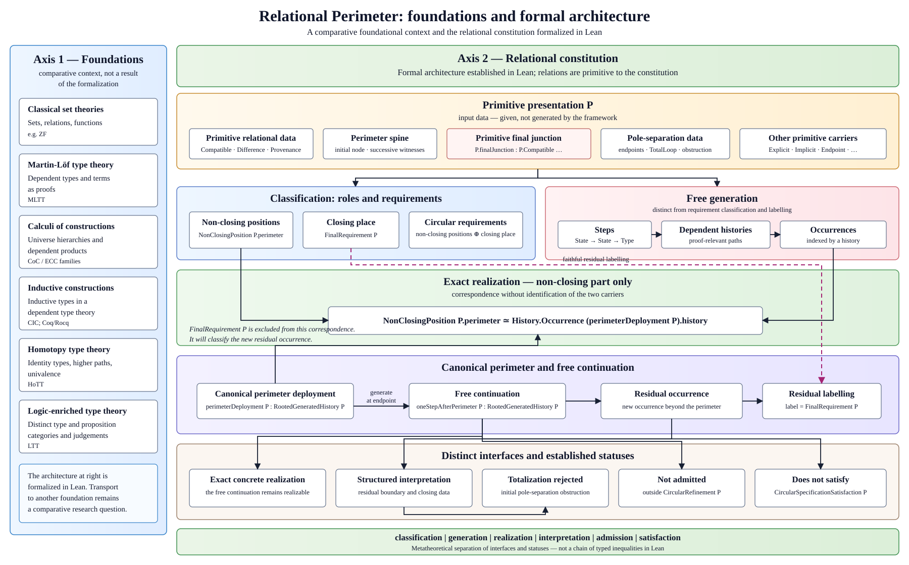

## Foreword

*Mathematicians now have, with Lean, a proof tool precise enough to compare not
only the results proved, but the meanings that proofs acquire according to the
formal ontologies in which they are situated.*

*`Relational Perimeter` puts this possibility to the test by treating relations
as primitives of formal constitution. From this choice, it re-examines the
meanings of familiar notions such as role, perimeter, circularity, closure,
whole, residual, transport, and turning. It follows their constitution in the
types: which relations are primitive, which witnesses are given, which
occurrences are generated, which relations are preserved by transports, and
which data are actually consumed by proofs.*

*In this sense, the framework is endogenous relative to the primitive
presentation it receives. It does not generate its own primitives; within a
single typed architecture, it constructs or establishes the identities, roles,
histories, exact quantity of the perimeter, and changes of status that proceed
from them.*

*The carrier, understood as the formal support equipped with its structure, is
not neutral. In the four-node example, separating models show that local data
alone determine neither order nor participation in the whole. For every
presentation, returning to a rooted, composable history then makes it possible
to reconstruct order, adjacency, and factorization from the global constitution
of the object.*

*The scope of this formalization goes beyond a mere terminological refinement.
By stratifying construction, realization, admission, and satisfaction of a
specification, it shifts the very criteria of identity and completeness. An
occurrence receives its identity from the relational history that constitutes
it, not from its value alone. A whole is complete when its relations positively
determine its interior domain, not when it exhausts every possible continuation.
What might appear as incompleteness then becomes the non-exhaustion of
generation. The affirmative perimetral turning designates the exact point at
which, beyond an already constituted and complete whole, generation produces a
continuation outside the regime in which that whole is maximal.*

*The perimeter thus determines an exact quantity whose exactness does not
depend on numerical evaluation. This quantity is carried by the reversible
correspondence between the successive positions and the occurrences of the
deployment; their order and adjacency are established by distinct structural
relations. The closing place completes the circular system of requirements
without entering this interior quantity, since it is not generated as an
occurrence. `History.length` provides only a subsequent, derived numerical
reading of it.*

*The methodological distinction between theorem and chain extends this
stratification without opposing them as two unrelated terms. The theorem
expresses a terminal propositional result; the chain retains the relations,
witnesses, provenances, and typed dependencies within which its proof acquires
its meaning. The same theorem may be situated in different constitutive chains;
conversely, a chain may carry more structure than the theorem's minimal logical
proof actually consumes. Comparison therefore holds together what proofs
establish and the relational constitution within which they establish it.*

*This approach makes comparable what terminal theorems alone leave invisible.
Two systems may establish similar propositional results while giving objects
and proofs different relational constitutions, and therefore different
meanings. The relational constitution of the perimeter, circularity, and the
affirmative perimetral turning provide the formal setting in which this method
is deployed.*

<br>

# Relational Perimeter

**Primitive relations, constituted wholes, and affirmative perimetral turning in Lean**

This repository contains a constructive Lean formalization in which relations
are part of the constitution of formal objects rather than annotations added
afterwards. A single proof-relevant family,
`Compatible : Implicit → Explicit → Type`, occurs in three distinct positions:
inside each node, between successive nodes, and at the distinguished closing
pair.

The formalization separates:

- given relational witnesses from the generated occurrences that realize them;
- the constituted perimeter from the primitive closing junction;
- relational closure from node identity, pole identification, and periodic
  return;
- residual determination from the proof-theoretic source of rejection;
- exact carrier transport from preservation of relational architecture;
- continued constitution from admission by the circular regime.

The resulting **affirmative perimetral turning** is the first generated step
beyond the constituted perimeter. It remains constructed, locally exact,
faithfully labelable in the unique residual role, and exactly interpretable,
while falling outside the preceding regime and specification.

The same relational method is extended to computation. The repository exhibits
a search whose **operational decomposition is produced by the computation**:
opening creates two structurally distinct alternatives, an executed search
reconstructs a directed transport between them, and a separate preservation
proof permits one obligation to be absorbed for the criterion under study.
Neither equality of the alternatives nor impossibility of the absorbed one is
asserted. The retained result and its provenance then condition the next
discovery.

## Positioning and scope



`Relational Perimeter` is a relational architecture formalized in dependent
type theory in Lean, not a competing logical foundation. Its constitutive
primitive relations, generated histories, exact realizations, interpretations,
regimes, and specifications remain separate interfaces. In particular, a
continuation may be positively generated, equipped with an exact concrete
realization, faithfully classified by its unique residual place, and
structurally interpreted without being admitted to the circular regime or
satisfying the circular specification.

The canonical positioning statement, its limits, and the primary references
for the external comparisons are available in the parallel versions listed
below.

## Documents

- [English presentation](docs/primitive-relations-and-perimeter-constitution.en.md)
- [Présentation française](docs/relations-primitives-constitution-perimetre.fr.md)
- [Positioning and scope](docs/positioning-and-scope.en.md)
- [Positionnement et portée](docs/positionnement-et-portee.fr.md)
- [Endogenous operational decomposition](docs/endogenous-operational-decomposition.en.md)
- [Décomposition opérationnelle endogène](docs/decomposition-operationnelle-endogene.fr.md)
- [Conceptual authorship and AI-generation disclosure](AI_AUTHORSHIP.md)

## Foundational Lean sources

- `SegmentedResidualRole.lean`: abstract residual-role determination;
- `AbstractSegmentedTurning.lean`: abstract boundary, continuation, and regime
  turning;
- `ExactTypeTransport.lean`: constructive two-sided transport between types;
- `StrongPerimetralTurning.lean`: the constructive circular presentation and
  its perimetral instance.

## Computational construction

- `RelationalPerimeter/Computation/ConstitutiveGeneration.lean` connects the
  computation directly to the generated histories of the four foundational
  modules;
- `RelationalPerimeter/Computation/EndogenousOperationalDecomposition.lean` is
  the public statement layer for the computational phenomenon;
- `RelationalPerimeter/Computation/ConstitutiveSearch/` contains the complete
  executable construction, its relational transports, SAT instance, feedback
  recursion, and production-level measured accounting;
- `Tests/ComputationalPhenomenonRegression.lean` reproduces the independent
  adversarial counterprobes, including the production seed and the causal
  connection between measured initialization and the first threaded state;
- `Tests/ConstitutiveExecutionRegression.lean` protects the complete executed
  and measured surface.

The computational tree imports the foundational modules directly. It has no
dependency on an external alignment layer, a separate foundation layer, or a
readout facade.

## Build

The repository pins Lean 4.33.1 and has no Mathlib dependency.

```text
lake build
```

The complete repository gate is available on both supported command surfaces:

```text
powershell -File scripts/verify.ps1
bash scripts/verify.sh
```

All Lean sources are constructive: they contain no `sorry`, `axiom`, or
`noncomputable` declaration, and their final axiom-audit blocks report no axiom
dependency for the audited declarations. The default build includes the public
modules and both regression suites.

## Résumé français

Ce dépôt formalise en Lean une architecture constructive où les relations sont
primitives et participent à la constitution des objets, des occurrences et des
chaînes. Le périmètre est l'histoire enracinée et composable qui réalise les
jonctions successives données. La jonction fermante reste primitive et n'est
pas parcourue par la génération. Le premier pas au-delà du périmètre constitue
un tournant périmétral affirmatif : la génération continue, tandis que
l'incorporation de cette continuation dans le même régime devient impossible.

Cette architecture porte aussi une décomposition opérationnelle endogène de la
recherche. L’ouverture produit une multiplicité structurelle ; une relation
dirigée est ensuite reconstruite par l’exécution, sa préservation est prouvée
séparément, et le résultat retenu conditionne la découverte suivante. Ainsi, le
nombre d’alternatives engendrées et le nombre d’obligations qui doivent rester
indépendantes ne sont pas confondus.

## License

Apache-2.0. See [LICENSE](LICENSE).
