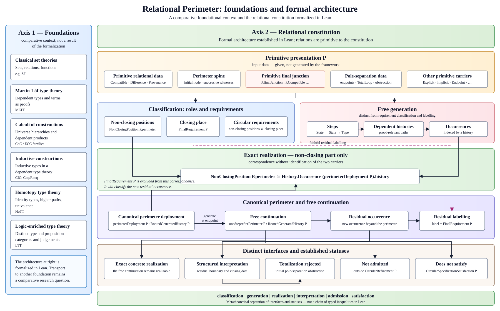

## Foreword

*Mathematicians now have, with Lean, a proof tool precise enough to compare not
only the results proved, but the meanings that proofs acquire according to the
formal ontologies in which they are situated.*

*`Relational Perimeter` puts this possibility to the test by treating relations
as primitives of formal constitution. From this choice, it re-examines the
meanings of familiar notions such as role, perimeter, circularity, closure,
whole, residual, transport, and turning. It follows their constitution in the
types: which relations are primitive, which witnesses are given, which
occurrences are generated, which relations are preserved by transports, and
which data are actually consumed by proofs.*

*In this sense, the framework is endogenous relative to the primitive
presentation it receives. It does not generate its own primitives; within a
single typed architecture, it constructs or establishes the identities, roles,
histories, exact quantity of the perimeter, and changes of status that proceed
from them.*

*The carrier, understood as the formal support equipped with its structure, is
not neutral. In the four-node example, separating models show that local data
alone determine neither order nor participation in the whole. For every
presentation, returning to a rooted, composable history then makes it possible
to reconstruct order, adjacency, and factorization from the global constitution
of the object.*

*The scope of this formalization goes beyond a mere terminological refinement.
By stratifying construction, realization, admission, and satisfaction of a
specification, it shifts the very criteria of identity and completeness. An
occurrence receives its identity from the relational history that constitutes
it, not from its value alone. A whole is complete when its relations positively
determine its interior domain, not when it exhausts every possible continuation.
What might appear as incompleteness then becomes the non-exhaustion of
generation. The affirmative perimetral turning designates the exact point at
which, beyond an already constituted and complete whole, generation produces a
continuation outside the regime in which that whole is maximal.*

*The perimeter thus determines an exact quantity whose exactness does not
depend on numerical evaluation. This quantity is carried by the reversible
correspondence between the successive positions and the occurrences of the
deployment; their order and adjacency are established by distinct structural
relations. The closing place completes the circular system of requirements
without entering this interior quantity, since it is not generated as an
occurrence. `History.length` provides only a subsequent, derived numerical
reading of it.*

*The methodological distinction between theorem and chain extends this
stratification without opposing them as two unrelated terms. The theorem
expresses a terminal propositional result; the chain retains the relations,
witnesses, provenances, and typed dependencies within which its proof acquires
its meaning. The same theorem may be situated in different constitutive chains;
conversely, a chain may carry more structure than the theorem's minimal logical
proof actually consumes. Comparison therefore holds together what proofs
establish and the relational constitution within which they establish it.*

*This approach makes comparable what terminal theorems alone leave invisible.
Two systems may establish similar propositional results while giving objects
and proofs different relational constitutions, and therefore different
meanings. The relational constitution of the perimeter, circularity, and the
affirmative perimetral turning provide the formal setting in which this method
is deployed.*

<br>

# Relational Perimeter

**Primitive relations, constituted wholes, and affirmative perimetral turning in Lean**

This repository contains a constructive Lean formalization in which relations
are part of the constitution of formal objects rather than annotations added
afterwards. A single proof-relevant family,
`Compatible : Implicit → Explicit → Type`, occurs in three distinct positions:
inside each node, between successive nodes, and at the distinguished closing
pair.

The formalization separates:

- given relational witnesses from the generated occurrences that realize them;
- the constituted perimeter from the primitive closing junction;
- relational closure from node identity, pole identification, and periodic
  return;
- residual determination from the proof-theoretic source of rejection;
- exact carrier transport from preservation of relational architecture;
- continued constitution from admission by the circular regime.

The resulting **affirmative perimetral turning** is the first generated step
beyond the constituted perimeter. It remains constructed, locally exact,
faithfully labelable in the unique residual role, and exactly interpretable,
while falling outside the preceding regime and specification.

The same relational method is extended to computation. The repository exhibits
a search whose **operational decomposition is produced by the computation**:
opening creates two structurally distinct alternatives, an executed search
reconstructs a directed transport between them, and a separate preservation
proof permits one obligation to be absorbed for the criterion under study.
Neither equality of the alternatives nor impossibility of the absorbed one is
asserted. The retained result and its provenance then condition the next
discovery.


The framework first constitutes the structured objects on which the computation
acts. The executed discovery then supplies the operational status used to index
the same opening either as a pending two-position carrier or as a retained
one-position carrier. For `n` executed openings, the complete structural
carrier and the pending carrier both have exact width `2^n`, while the carrier
of positions retained by the discovered transports has exact width `1`. The
numerical transient trace `1 → 2 → 1` at each stage is a derived readout of
those frontier objects and is uniformly bounded by `2`; it is not a causal
premise of the reduction. The closed causal evidence package is canonically
built from the executed role history and records the exact reduction history,
failed-candidate work, discovered total map, separate preservation proof,
extensional projection, and output transmitted to the next situation. Sibling
viability and distinction remain separately proved positive consequences.

A state-and-quantity projection preserves the observed states, output, width
readout, and bound, but does not determine the total operational action. At the
generic level, `ActionFactorsThrough` expresses recoverability of a total
action from a projection, while `AnchoredActionProjectionCollision` records
equal projected values whose total actions differ at one argument and fixes
its first preimage in the witness type. On the
actual executed generated system, the total transport stored by the
authoritative instruction and a comparison transport instantiate this
collision: their separately constructed views are equal, they agree at the
observed executed continuation, and their total actions differ on another
admissible continuation. The instruction acts pointwise as the discovered
relation on every continuation. The public collision theorem mentions that
authoritative instruction explicitly in its conclusion. In this exact sense,
the specified state-and-quantity view is a forgetful projection of the
constituted operational process.


The repository now proves the production hierarchy behind the representation
comparison. For a public run with `n = input + 1` constituted openings, the
executed role history constructs an authoritative typed program with exactly
`n` transport instructions. `StructuralObligation` is literally the profile
type of that program, and `structuralFrontier` is literally its complete,
duplicate-free binary expansion, of exact width `2^n`. At every step the two
profile constructors belong to the stored instruction's own indexed
`Alternative` type; profiles for distinct instructions are not directly
interchangeable. The exact cardinality depends only on the instruction count
because each indexed alternative has exactly two constructors. Any finite interface
that keeps those program-produced profiles independently addressable therefore
requires at least `2^n` distinct slots. The same program interprets every
accepted profile in its expansion exactly as the canonical normalizer and
every generated profile has a positively constructed accepted payload indexed
by that program. A separate sensitivity theorem states that different raw
instruction actions produce different interpreted left outputs whenever they
differ on the accepted payload. It erases to the exact returned-code history.
Its raw atom count is proved equal to `compiledLocalSize` and to `n`.

The extensive profile space is thus a deployment of the constituted program,
not a parallel carrier sharing only a common index. The audited
state-and-quantity view is further downstream: it is a projection of an
authoritative instruction's total action, and the existing collision theorem
shows that this projection does not reconstruct the total action. The derived
operational-width reading and the internal instrumented cost remain separate
results. The statement is representation-relative: it proves the exact lower
bound for independent finite addressing, not a universal time or memory lower
bound for every possible representation.


## Positioning and scope



`Relational Perimeter` is a relational architecture formalized in dependent
type theory in Lean, not a competing logical foundation. Its constitutive
primitive relations, generated histories, exact realizations, interpretations,
regimes, and specifications remain separate interfaces. In particular, a
continuation may be positively generated, equipped with an exact concrete
realization, faithfully classified by its unique residual place, and
structurally interpreted without being admitted to the circular regime or
satisfying the circular specification.

The canonical positioning statement, its limits, and the primary references
for the external comparisons are available in the parallel versions listed
below.

## Documents

- [English presentation](docs/primitive-relations-and-perimeter-constitution.en.md)
- [Présentation française](docs/relations-primitives-constitution-perimetre.fr.md)
- [Positioning and scope](docs/positioning-and-scope.en.md)
- [Positionnement et portée](docs/positionnement-et-portee.fr.md)
- [Endogenous operational decomposition](docs/endogenous-operational-decomposition.en.md)
- [Décomposition opérationnelle endogène](docs/decomposition-operationnelle-endogene.fr.md)
- [Conceptual authorship and AI-generation disclosure](AI_AUTHORSHIP.md)

## Foundational Lean sources

- `SegmentedResidualRole.lean`: abstract residual-role determination;
- `AbstractSegmentedTurning.lean`: abstract boundary, continuation, and regime
  turning;
- `ExactTypeTransport.lean`: constructive two-sided transport between types;
- `StrongPerimetralTurning.lean`: the constructive circular presentation and
  its perimetral instance.

## Computational construction

- `RelationalPerimeter/Computation/ConstitutiveGeneration.lean` connects the
  computation directly to the generated histories of the four foundational
  modules;
- `RelationalPerimeter/Computation/EndogenousOperationalDecomposition.lean` is
  the public statement layer for the computational phenomenon;
- `RelationalPerimeter/Computation/ConstitutiveSearch/` contains the complete
  executable construction, its relational transports, SAT instance, feedback
  recursion, and production-level measured accounting;
- `Tests/ComputationalPhenomenonRegression.lean` protects the production
  statements corresponding to the independently enumerated adversarial probes,
  including the production seed and the causal connection between measured
  initialization and the first threaded state;
- `Tests/ConstitutiveExecutionRegression.lean` protects the complete executed
  and measured surface;
- `Tests/EndogenousOperationalStabilityRegression.lean` protects the exact
  structural, pending, executed, and transient widths together with the causal
  map, measured-failure, wrong-singleton, and non-factorization boundaries. In
  particular, it checks the public `ActionFactorsThrough` statement and a
  generic projection collision whose equality is propositional rather than
  definitional.

The computational tree imports the foundational modules directly. It has no
dependency on an external alignment layer, a separate foundation layer, or a
readout facade.

## Build

The repository pins Lean 4.33.1 and has no Mathlib dependency.

```text
lake build
```

The complete repository gate is available on both supported command surfaces:

```text
pwsh -NoProfile -File scripts/verify.ps1
bash scripts/verify.sh
```

Both gates traverse the declared import boundaries and compile four
expected-failure fixtures. These fixtures verify that the public certificate
constructor remains private, that profiles from distinct stored instructions
are not directly interchangeable, that the projection collision remains indexed
by the authoritative instruction transport, and that an interpreter which
ignores an arbitrary raw instruction cannot satisfy its semantic output
specification.

All Lean sources are constructive: they contain no `sorry`, `axiom`, or
`noncomputable` declaration, and their final axiom-audit blocks report no axiom
dependency for the audited declarations. The default build includes the public
modules and the regression suites.

## Résumé français

Ce dépôt formalise en Lean une architecture constructive où les relations sont
primitives et participent à la constitution des objets, des occurrences et des
chaînes. Le périmètre est l'histoire enracinée et composable qui réalise les
jonctions successives données. La jonction fermante reste primitive et n'est
pas parcourue par la génération. Le premier pas au-delà du périmètre constitue
un tournant périmétral affirmatif : la génération continue, tandis que
l'incorporation de cette continuation dans le même régime devient impossible.

Cette architecture porte aussi une décomposition opérationnelle endogène de la
recherche. L’ouverture produit une multiplicité structurelle ; une relation
dirigée est ensuite reconstruite par l’exécution, sa préservation est prouvée
séparément, et le résultat retenu conditionne la découverte suivante. Ainsi, le
nombre d’alternatives engendrées et le nombre d’obligations qui doivent rester
indépendantes ne sont pas confondus.

Pour `n` ouvertures exécutées, les carriers structurel et opérationnel en
attente ont une largeur exacte `2^n`, tandis que le carrier des positions
retenues par les transports découverts a une largeur exacte `1`. La lecture
numérique transitoire `1 → 2 → 1` est dérivée des frontières constituées et
reste uniformément bornée par `2` ; elle n’est pas une prémisse causale de la
réduction. Une projection par état et quantité conserve cette stabilité
observée sans déterminer l’action opérationnelle totale. Le transport total
porté par l’instruction faisant autorité et le transport de comparaison sont
projetés séparément vers deux vues égales, alors que leurs actions totales
diffèrent sur une autre continuation admissible. L’instruction agit point par
point comme la relation découverte sur toute continuation. Le théorème
générique de non-factorisation consomme explicitement cette égalité de
projections.

Le dépôt prouve désormais la hiérarchie de production qui fonde la comparaison
de représentations. Pour une exécution publique comportant
`n = input + 1` ouvertures constituées, l’histoire exécutée de rôles construit
un programme typé faisant autorité avec exactement `n` instructions de
transport. `StructuralObligation` est littéralement le type des profils de ce
programme, et `structuralFrontier` est littéralement son expansion binaire
complète, sans doublon, de largeur exacte `2^n`. Toute interface finie qui
conserve ces profils produits par le programme comme adresses indépendantes
exige donc au moins `2^n` emplacements distincts. Le même programme interprète
exactement toute charge acceptée de son expansion comme le normalisateur
canonique, et chaque profil engendré possède une charge acceptée construite
positivement et indexée par ce programme. À chaque étape, les deux constructeurs
du profil appartiennent au type `Alternative` indexé par l’instruction stockée ;
les profils d’instructions distinctes ne sont pas directement interchangeables.
La cardinalité exacte ne dépend que du nombre d’instructions parce que chaque
alternative indexée possède exactement deux constructeurs. Un théorème de
sensibilité séparé établit que deux actions brutes distinctes donnent des
sorties gauches interprétées distinctes dès qu’elles diffèrent sur la charge
acceptée. Le programme s’efface vers l’histoire exacte des codes retournés. Son
nombre d’atomes brut est prouvé égal à `compiledLocalSize` et à `n`.

L’espace extensif des profils est ainsi un déploiement du programme constitué,
et non un carrier parallèle partageant seulement un même index. La vue auditée
par état et quantité se trouve encore en aval : elle est une projection de
l’action totale d’une instruction faisant autorité. La collision est ancrée
dans son type sur cette instruction, que son énoncé public mentionne
explicitement, et elle établit que cette projection déterminée ne reconstruit
pas l’action totale. La largeur
opérationnelle dérivée et le coût instrumenté interne restent des résultats
séparés. L’énoncé est relatif à la représentation : il prouve la borne exacte
de l’adressage fini indépendant, non une borne universelle en temps ou en
mémoire pour toute représentation possible.


## License

Apache-2.0. See [LICENSE](LICENSE).
