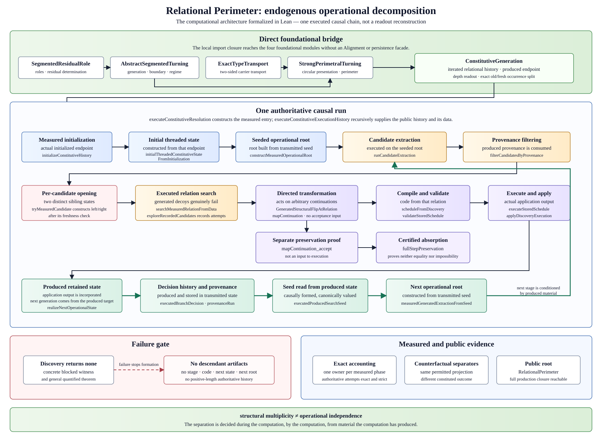
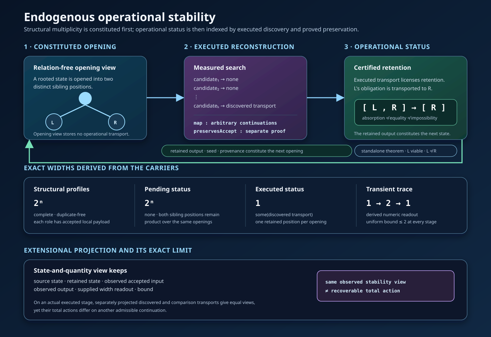

# Décomposition opérationnelle endogène

## Résultat

La construction exhibe une recherche dont la **décomposition opérationnelle
est un produit du calcul, et non une donnée de sa structure de branchement**.

L’ouverture produit une multiplicité structurelle. Le calcul dote cette
multiplicité d’un statut opérationnel à partir d’une transformation qui :

1. n’existe pas comme donnée avant que l’exécution ne la reconstruise ;
2. est trouvée par un travail effectivement exécuté, qui échoue sur la plupart
   des relations candidates ;
3. agit sur des continuations arbitraires, avant que l’on sache quelle
   alternative est acceptée ;
4. possède une preuve de préservation distincte, qui autorise l’abandon d’une
   alternative pour le critère considéré, sans identifier les alternatives et
   sans prouver l’impossibilité de celle qui est abandonnée.

Le résultat de la transformation fournit ensuite l’état retenu, la graine,
l’histoire des décisions et la provenance utilisés par l’étape suivante. La
reconstruction suivante a donc lieu sous des conditions produites par la
précédente.

En bref, **la multiplicité structurelle et l’indépendance opérationnelle sont
séparées, et leur statut opérationnel est constitué pendant le calcul à partir
de matériaux produits par le calcul**.



## Stabilité opérationnelle et branchement exponentiel

Le cadre constitue d’abord les objets structurés sur lesquels le calcul agit.
La découverte exécutée fournit ensuite le témoin de transport qui indexe le
statut opérationnel d’une ouverture ; une loi de préservation prouvée
séparément autorise l’absorption correspondante pour le critère étudié.

Pour une histoire exécutée contenant `n` ouvertures, le dépôt construit trois
carriers finis à partir des mêmes ouvertures :

- le carrier complet et sans doublon des profils structurels a pour largeur
  exacte `2^n` ;
- avant qu’un transport ne licence une réduction, le carrier des profils
  opérationnels en attente possède la même largeur exacte `2^n` ;
- après que chaque découverte exécutée a fourni son transport et sa preuve de
  préservation, le carrier des positions opérationnelles retenues a pour
  largeur exacte `1`.

Ces nombres sont lus sur des carriers énumérés, et non stockés comme des
annotations indépendantes. Chaque rôle structurel possède une charge locale
acceptée construite positivement. Pour une même ouverture exécutée, le type des
positions indexé par `none` contient les deux positions sœurs, tandis que le
type indexé par `some discoveredTransport` contient exactement la position
retenue. Le carrier retenu global combine récursivement ces types de positions
indexés par leur statut. Un singleton de même largeur numérique construit
depuis l’autre frère est prouvé distinct de la frontière exactement retenue.
L’égalité des largeurs ne remplace donc pas la réduction sémantique.

La trace transitoire `1 → 2 → 1` est une lecture numérique des frontières
d’entrée, d’ouverture et de rétention de chaque étape, uniformément bornée par
`2`. Dans cette famille explicite, ces longueurs se réduisent
définitionnellement à la même lecture littérale ; la trace n’est donc pas une
prémisse causale porteuse. L’énoncé causal est porté par les types de positions
indexés par le statut et par les actions de transport : effacer le transport du
statut indexe la même ouverture par deux positions en attente, tandis que
l’incorporation du transport retourné par la découverte exécutée l’indexe par
la seule position retenue. L’itération de cette distinction sépare la largeur
en attente `2^n` de la largeur retenue `1`. Le carrier `2^n` représente les
choix structurels indépendants ; il n’est pas présenté comme une liste de
`2^n` états spontanément émis par le moteur séquentiel.

Le contenu causal est typé indépendamment de cette arithmétique. Le préfixe des
candidats en échec est extrait de la recherche exécutée elle-même, chacun de ses
membres est prouvé en échec, le candidat sélectionné est prouvé réussi, et le
nombre mesuré de tentatives est exactement la longueur de ce préfixe augmentée
d’une unité. Pour la découverte canonique d’origine initiale associée à chaque
profondeur d’entrée, au moins neuf dixièmes des tentatives mesurées
appartiennent à ce préfixe d’échecs prouvés ; cet énoncé est limité à cette
exécution initiale et non à toutes les étapes de l’histoire publique.
L’application découverte agit sur des continuations arbitraires. Sa loi de
préservation est consommée séparément. Le frère absorbé reste viable et
distinct comme conséquence positive prouvée séparément, et non comme prémisse
du certificat de réduction ; la sortie retenue est la donnée transmise à la
situation constituée suivante. Sur cette famille explicite, la relation
réussie possède une valeur canonique à chaque profondeur fixée ; son statut
opérationnel est néanmoins constitué par la recherche exécutée qui la retourne,
enregistre le préfixe d’échecs, fournit son transport typé et transmet son
résultat à l’état suivant.



### Limite exacte d’une projection par état et quantité

Le dépôt construit également une vue extensionnelle de stabilité qui conserve
les états source et retenu, une entrée acceptée observée et sa sortie, une
lecture numérique de largeur fournie explicitement et sa borne. Sur le système
engendré d’une étape effectivement exécutée, il projette séparément le transport
découvert et un transport total de comparaison possédant la même source et la
même cible exécutées. Les deux vues projetées sont égales pour la continuation
exécutée observée, tandis que les deux actions totales diffèrent sur une autre
continuation admissible. Aucune fonction unique de ces vues extensionnellement
égales ne peut donc reconstruire les deux actions opérationnelles totales.

Cela identifie la limite relative exacte d’une lecture de type Lyapunov dans la
présente construction. Une description par états, trajectoire observée et
quantité bornée est une projection par oubli du processus opérationnel
constitué : elle enregistre la stabilité, mais elle ne détermine pas la
transformation dont la reconstruction exécutée a produit cette stabilité. Il
s’agit d’un résultat formel de non-factorisation pour la projection définie ici,
et non de la prétention d’avoir formalisé toute version de la théorie classique
de la stabilité.

## Chaîne exécutée

Pour chaque entrée, une récursion faisant autorité construit la chaîne suivante :

```text
état constitué
  → racine opérationnelle engendrée
  → extraction endogène des candidats
  → filtrage par la provenance produite
  → ouverture structurelle en deux enfants distincts
  → recherche exécutée d’une relation entre eux
  → compilation et validation du transport découvert
  → application à une continuation arbitraire
  → preuve séparée de préservation de l’acceptation et de la viabilité
  → cible retenue et détermination booléenne exécutée
  → transmission de la graine, de l’histoire des décisions et de la provenance
  → racine, domaine de candidats et recherche de relation suivants
```

Le calcul public est
`ConstitutiveSearch.EndogenousDecomposition.executeConstitutiveResolution`.
Son résultat est projeté depuis `executeConstitutiveExecutionHistory` ; aucune
seconde exécution ne fournit parallèlement l’histoire publique, l’état terminal,
la décision ou la comptabilité.

La frontière d’entrée suit la même discipline causale. Le premier état transmis
est construit depuis le point terminal enregistré par l’initialisation mesurée
effectivement exécutée. Sa génération est ensuite prouvée égale à la génération
canonique ; aucune source reconstruite indépendamment ne remplace celle qui a
été produite.

## Ce que les types séparent

Les types maintiennent visibles les distinctions suivantes :

- la génération de deux alternatives n’est pas leur indépendance
  opérationnelle ;
- une application totale sur les continuations n’est pas son théorème de
  préservation de l’acceptation ;
- la préservation relative à un critère n’est pas l’égalité des alternatives ;
- l’absorption d’une obligation n’est pas une preuve que l’alternative absorbée
  est impossible ;
- l’égalité d’une lecture n’est pas l’égalité de la recherche constituée ;
- la formation causale d’une graine par un état produit demeure distincte de
  l’invariant qui détermine sa valeur canonique ;
- un transport exact réversible n’est pas le transport dirigé utilisé pour
  l’absorption.

Cette dernière distinction raccorde directement la computation aux quatre
modules fondamentaux. `ExactTypeTransport` enregistre un transport réversible
entre carriers. `AcceptingContinuationTransport`, au contraire, contient une
application dirigée et une loi de préservation séparée. Le résultat
computationnel dépend de ce second transport sans le renforcer silencieusement
en équivalence.

## Évidence exposée par le dépôt

Le module public de formulation est
[`EndogenousOperationalDecomposition.lean`](../RelationalPerimeter/Computation/EndogenousOperationalDecomposition.lean).
Il expose des déclarations sans axiome pour :

- la distinction structurelle des alternatives ouvertes ;
- la transformation totale de continuations arbitraires ;
- la preuve séparée de préservation de l’acceptation ;
- le transport de la viabilité et la préservation exacte de la viabilité de la
  frontière ;
- l’indépendance du pas complet à l’égard d’une preuve d’acceptation ;
- l’absence de toute étape construite et de toute histoire descendante faisant
  autorité de longueur positive après l’échec de la découverte ;
- l’échec de chaque relation candidate leurre engendrée et le nombre exact de
  tentatives précédant la réussite de la découverte ;
- la loi exacte des tentatives filtrées par la provenance et la croissance
  stricte du compteur total de recherche de relation émis par la récursion
  faisant autorité, en plus de la croissance de la recherche locale de
  référence ;
- la construction du premier état transmis depuis le point terminal de
  l’initialisation mesurée ;
- la formation, au niveau des constructeurs, de la graine et du faisceau
  d’extraction suivants à partir de l’état exécuté, distincte des preuves
  ultérieures de leur égalité canonique ;
- la consommation de la graine et de la provenance produites par la découverte
  suivante ;
- des lectures projetées égales dont les traces candidates constituées
  diffèrent ;
- des comparaisons contrefactuelles construites depuis une même origine
  exécutée : la comparaison de l’état retenu avec l’état à histoire effacée
  sépare les traces candidates constituées, tandis que la comparaison avec
  l’état bloqué sépare les histoires décisionnelles et les résultats de la
  découverte malgré l’accord de toute donnée projetable autorisée ; les
  comparateurs effacé et bloqué ne sont pas eux-mêmes émis par la récursion
  faisant autorité ;
- la non-factorisation du résultat suivant par la projection autorisée sur ce
  domaine séparateur à deux points : la projection lit l’affectation, la
  génération et la graine de recherche, dont les valeurs sont délibérément
  égales pour les deux comparateurs ;
- une comptabilité mesurée canonique, à propriétaire unique, et les bornes
  polynomiales portant sur le travail explicitement instrumenté de la famille
  construite ;
- des carriers structurels complets et sans doublon de largeur exacte `2^n`,
  des carriers en attente de largeur exacte `2^n` et des carriers opérationnels
  retenus de largeur exacte `1` ;
- la comparaison locale indexée par le type sur une ouverture exécutée :
  largeur `2` en l’absence de transport opérationnel et largeur `1` avec le
  transport retourné par la découverte exécutée ;
- des charges locales acceptées pour chaque rôle structurel, avec la trace
  transitoire exacte `1 → 2 → 1` et sa borne uniforme `2` ;
- l’extraction du préfixe des candidats effectivement en échec et l’équation
  exacte entre sa longueur et le nombre mesuré de tentatives ;
- la preuve qu’un mauvais singleton peut posséder la bonne largeur numérique
  tout en différant de la cible sémantique exactement retenue ;
- la non-factorisation de l’action opérationnelle totale par la vue
  extensionnelle de stabilité fondée sur l’état et la quantité, à la fois dans
  un séparateur générique fini et sur le système engendré d’une étape
  effectivement exécutée.

L’implémentation complète demeure sous
`RelationalPerimeter/Computation/ConstitutiveSearch/`. En particulier,
`OperationalFrontierStatus.lean` définit la frontière générique entre attente
et réduction, tandis que `ExecutedOperationalReduction.lean`,
`ExecutedOperationalReductionHistory.lean`,
`ExtensionalOperationalStability.lean` et
`EndogenousOperationalStability.lean` établissent la chaîne causale exécutée,
ses carriers, ses largeurs exactes et la frontière de projection. Le module de
formulation est un point d’entrée vers cette implémentation, non son
remplacement. Les suites de régression comprennent
`EndogenousOperationalStabilityRegression.lean`, qui vérifie les largeurs
publiques, le changement local de largeur indexé par le statut, chaque champ de
la réduction exécutée exacte, le préfixe mesuré d’échecs, l’application
découverte, les histoires causales et le normaliseur exacts, la distinction du
mauvais singleton et les deux séparateurs de non-factorisation.

## Portée exacte

Le résultat est constructif, exécutable, uniformément indexé par la profondeur
et sans axiome. Il est instancié sur une famille SAT explicite engendrée, fondée
sur une symétrie par inversion de polarité. La découverte accomplit un travail
décidable réel, rejette des candidats leurres, et le compteur de tentatives émis
par la récursion faisant autorité, filtrée par la provenance, obéit à une loi
générale exacte et croît strictement avec les entrées successives. L’échec de la
découverte ne produit ni étape ni histoire descendante faisant autorité de
longueur positive.

La recherche suivante dépend du résultat précédent en deux sens différents :

- matériellement, la comparaison contrefactuelle de l’état produit avec des
  états effacé et bloqué construits depuis la même origine exécutée montre
  que l’histoire des décisions et la provenance peuvent changer le domaine de
  candidats et le résultat de la découverte suivante ; les états comparateurs
  sont des constructions d’analyse, non des états supplémentaires émis par la
  récursion faisant autorité ;
- causalement, la racine suivante est formée depuis une graine lue sur l’état
  produit, bien que l’invariant de cet état force cette graine à être égale à sa
  valeur canonique.

Le dépôt n’établit ni `P = NP`, ni `P ≠ NP`, ni un solveur polynomial pour des
instances SAT arbitraires, ni un théorème portant sur tout espace de recherche.
Ses bornes polynomiales concernent des compteurs explicitement produits et le
paramètre unaire de la famille construite. Ces limites ne réduisent pas le
phénomène exhibé ; elles délimitent exactement le lieu où il est démontré.
