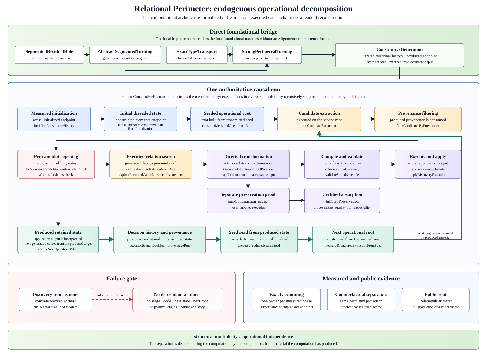
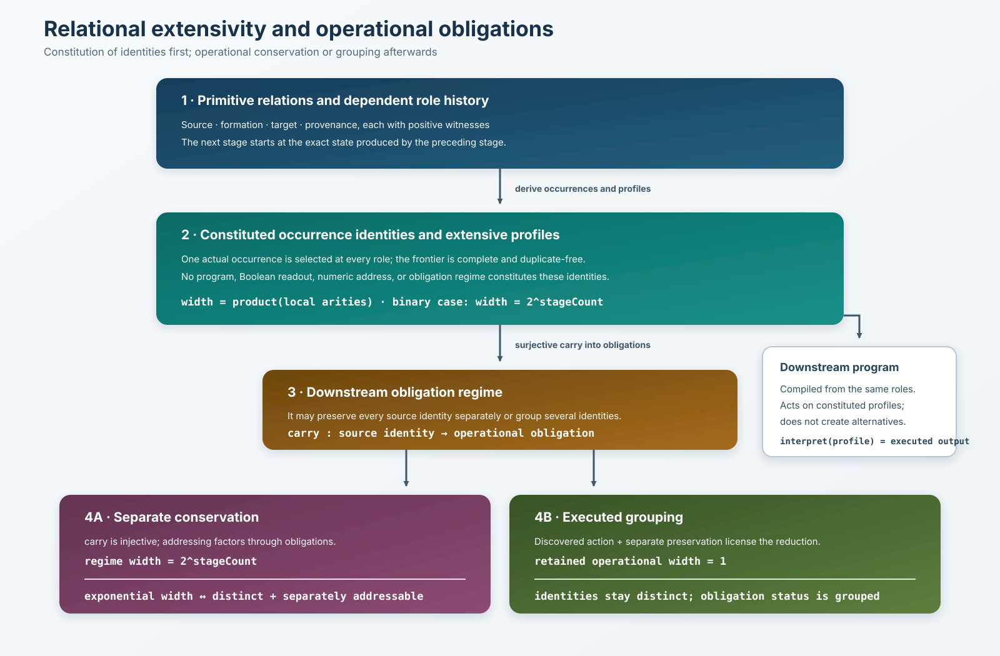
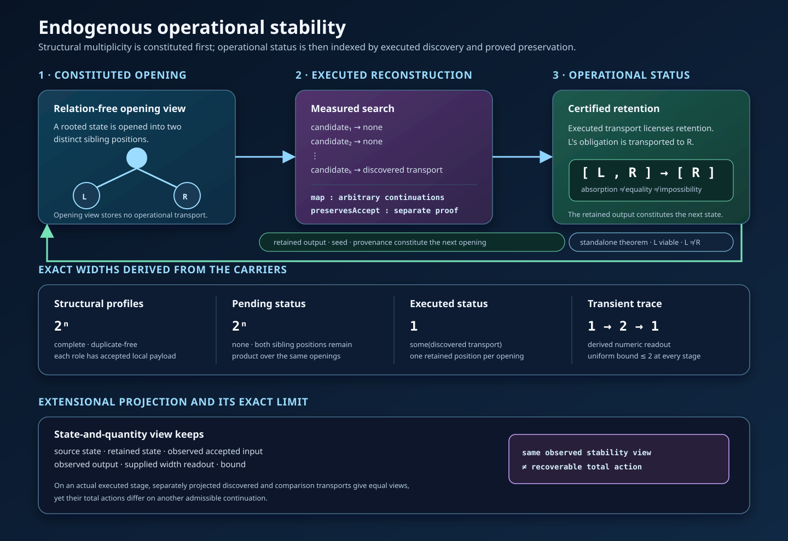

# Endogenous Operational Decomposition

## Result

The construction exhibits a search whose **operational decomposition is an
output of the computation rather than a datum of its branching structure**.

Opening produces structural multiplicity. The computation equips that
multiplicity with an operational status using a transformation that:

1. does not exist as data until the run reconstructs it;
2. is found by executed work that genuinely fails on most candidate relations;
3. acts on arbitrary continuations, before anything is known about which
   alternative is accepted;
4. comes with a separate preservation proof that licenses dropping one
   alternative for the criterion at hand, without identifying the alternatives
   and without proving the dropped one impossible.

The result of the transformation then supplies the retained state, seed,
decision history, and provenance used by the next stage. The following
reconstruction therefore takes place under conditions produced by the previous
one.

In short, **structural multiplicity and operational independence are
separated, and their operational status is constituted during the computation
from material the computation has produced**.



## Operational obligations and extensive readout

The order of constitution is explicit in the types. Primitive source,
formation, target, and provenance relations positively witness each opening.
A dependent history of those openings then constitutes local occurrence
identities. `RelationalOccurrenceProfile` selects one such identity at every
role. Its complete duplicate-free frontier, its list of arities, and its width
are all derived from that history before any program or operational regime is
introduced.

For every relational history, Lean proves

```text
profile width = product of the realized local arities.
```

Uniform arity `k` over `n` roles therefore gives `k^n`; local arity at least
two gives a lower bound `2^n`. The repository contains an unbounded
variable-arity family and, separately, an unbounded binary family independent
of the public SAT execution. The theorem is consequently stated over a general
class rather than inferred from one example.

An `ObligationRegime` is downstream of that carrier. Its surjective `carry`
map may preserve every constituted profile identity as a distinct operational
obligation or may group several identities. Separate addressing is required to
factor through those obligations. For every problem in every
`BinaryRelationalRoleExtensiveFamily`, the public theorem proves the genuine
equivalence

```text
regime width = 2^stageCount
  ↔ constituted identities remain distinct and separately addressable
     through that regime.
```

The same condition is equivalent to exact minimum factorized address capacity.
Neither side of the equivalence is stored in the other: exponential width is a
cardinality read from the regime frontier, whereas conservation is injectivity
of `carry` together with an address on obligations. The general finite proof is
constructive; the binary equation follows from the relationally constituted
local frontiers.

Both behaviours are positively realized on the same public carrier. The certificate
constructs the full-width identity regime and its complete factorized
conservation witness. Over those same constituted identities, the executed
regime has width one and does not preserve them as separate obligations.

On the public execution, one certificate joins the executed history, its
stagewise operational decomposition, the occurrence-profile carrier, and the
causal package of the executed regime. One stage decomposition receives only
that stage and no future tail. The dependent tail then begins at the state that
the stage actually produced. Roles and reduction licenses are read from this
same stagewise history. The program is downstream: it does not
constitute the profile alternatives. Each `RoleStageAtom` is tied to the
relation reconstructed by its role and acts on the actual occurrence selected
by a profile. The left occurrence applies that total action, the right
occurrence retains its continuation, and the compiled action is positively
proved to change the executed source.

For every source profile, `reduceExecutedRoleProfile` constructs a dependent
pair consisting of an obligation and an `ExecutedCarryDerivation` indexed by
that obligation. The derivation contains an `ExecutedRoleProfileReduction`
trace. Each local decision consumes the role
license: exact application of the discovered action, the separate
acceptance-preservation proof, viability of the retained output, non-identity
of the action on the executed source, and continued distinction of the
occurrences. The regime's `carry` is definitionally the first projection of
this pair; the executed package has no independently supplied `carry` field.
All traces have the same retained profile, so the regime has
width one; the source-indexed reduction witness is nevertheless exposed by the
API before that projection. The package constructor is private, so an
arbitrary constant `carry` cannot be installed and presented as the executed
regime.

The exponential `iff` applies directly to this regime on the same profile
carrier. Its local `2 → 1` width records are computed recursively from the
actual reduction history. Thus the source identities persist while their
operational independence changes.

The executed search remains essential to this public instance. Its failed
candidate prefix is extracted from the run, its selected relation is proved
successful, its map acts on arbitrary continuations, and its preservation law
is separate. The output, seed, decision history, and provenance then constitute
the conditions consumed by the next discovery.



This is an exact theorem about carrier width and factorized operational
addressing in the formal class above. It is not a universal time- or
memory-complexity lower bound. Instrumented execution cost and the
state-and-quantity projection remain separate downstream results.



### Exact limit of a state-and-quantity projection

The repository also constructs an extensional stability view that retains the
source and retained states, one observed accepted input and output, an
explicitly supplied numerical width readout, and its bound. The generic layer
defines `ActionFactorsThrough`: a total action factors through a projection
when one action on projected values recovers it on every argument. It also
defines `ActionProjectionCollision`: two preimages have equal projections but
their total actions differ at one argument. Its indexed form,
`AnchoredActionProjectionCollision project action first`, fixes the first
preimage in the witness type itself. The generic theorem
`action_not_factors_of_anchored_projection_collision` consumes that anchored
collision and constructively refutes factorization.

On the generated system of an actual executed stage, the total transport
denoted by the authoritative instruction and a comparison transport with the
same executed source and target form such a collision. The authoritative
instruction acts pointwise as the discovered relation on every continuation.
The two transports are separately projected; their projected views are equal
at the observed executed continuation, while their total actions differ on
another admissible continuation. The executed non-factorization theorem is
therefore an instance of the anchored generic theorem. Its public statement,
`authoritative_instruction_projection_collision`, explicitly exhibits a
collision whose first preimage is the authoritative program instruction; that
preimage is not a freely assignable field of the witness.

This identifies the exact relative limitation of the state-and-quantity
projection defined here. That projection retains states, one observed
trajectory segment, and a bounded quantity, but forgets part of the constituted
operational process: it records the stability readout without determining the
transformation whose executed reconstruction produced it. This is a formal
non-factorization result for this specified projection, not a claim that every
formulation of classical stability theory has been formalized.

## Executed chain

For each input, one authoritative recursion constructs the following chain:

```text
constituted state
  → generated operational root
  → endogenous candidate extraction
  → filtering by produced provenance
  → structural opening into two distinct children
  → executed search for a relation between them
  → compilation and validation of the discovered transport
  → application to an arbitrary continuation
  → separately proved preservation of acceptance and frontier viability
  → retained target and executed Boolean determination
  → transmitted seed, decision history, and provenance
  → next root, candidate domain, and relation search
```

The public computation is
`ConstitutiveSearch.EndogenousDecomposition.executeConstitutiveResolution`.
Its result is projected from
`executeConstitutiveExecutionHistory`; a second replay does not supply the
public history, terminal state, decision, or accounting.

The entry boundary follows the same causal discipline. The first threaded
state is constructed from the endpoint stored by the actual measured
initialization run. Its generation is then proved equal to the canonical
generation; an independently reconstructed source is not substituted for the
one that was produced.

## What is formally separated

The types keep the following distinctions visible:

- generation of two alternatives is not their operational independence;
- a total continuation map is not its acceptance-preservation theorem;
- preservation for a criterion is not equality of alternatives;
- absorption of one obligation is not a proof that the absorbed alternative is
  impossible;
- equality of a readout is not equality of the constituted search;
- causal formation of a seed by a produced state remains distinct from the
  invariant that determines its canonical value;
- exact two-sided transport is not the directed transport used for absorption.

The last distinction directly connects the computation to the four foundational
modules. `ExactTypeTransport` records reversible carrier transport. By contrast,
`AcceptingContinuationTransport` contains a directed map and a separate
preservation law. The computational result depends on the latter and does not
silently strengthen it into an equivalence.

## Evidence exposed by the repository

The public statement module is
[`EndogenousOperationalDecomposition.lean`](../RelationalPerimeter/Computation/EndogenousOperationalDecomposition.lean).
It exposes axiom-free declarations for:

- the general unbounded class of relational families whose complete frontier
  admits an extensive readout, and its binary subclass, together with an
  independent binary inhabitant and a
  variable-arity inhabitant of the wider class;
- the class-level equivalence between exact exponential regime width and
  conservation of constituted identities as distinct and separately
  addressable through that regime;
- the exact minimum factorized-capacity form of that equivalence;
- one public certificate tying the executed run, authoritative roles,
  occurrence profiles, downstream program, exact interpreter, and causal
  reduction to the same chain;
- the executed width-one regime that groups source identities without
  identifying them, with local widths recursively read from its reduction
  history;
- structural distinction of the opened alternatives;
- the total transformation of arbitrary continuations;
- the separate acceptance-preservation theorem;
- viability transport and exact preservation of frontier viability;
- the independence of the complete step from acceptance evidence;
- the absence of any constructed stage and of every positive-length
  authoritative descendant history after failed discovery;
- failure of every generated decoy relation candidate and the exact attempt
  count before discovery succeeds;
- the exact provenance-filtered attempt law and strict growth of the total
  relation-search counter emitted by the authoritative recursion, in addition
  to the stage-local reference growth;
- construction of the first threaded state from the endpoint of the measured
  initialization run;
- constructor-level formation of the next seed and extraction bundle from the
  executed state, distinct from their later canonical-equality proofs;
- consumption of the produced seed and provenance by the next discovery;
- equal projected readings with different constituted candidate traces;
- counterfactual comparisons constructed from one executed origin: comparison
  of the retained state with the history-erased state separates constituted
  candidate traces, while comparison with the blocked state separates decision
  histories and discovery outcomes despite agreement on every permitted
  projectable datum; the erased and blocked comparators are not themselves
  emitted by the authoritative run;
- non-factorization of the next outcome through the permitted projection on
  that two-point separator domain: the projection reads assignment, generation,
  and search seed, whose values are deliberately equal for the two comparators;
- canonical, uniquely owned measured accounting and the polynomial bounds on
  the explicitly instrumented work of the constructed family;
- complete and duplicate-free structural carriers of exact width `2^n`,
  pending carriers of exact width `2^n`, and retained operational carriers of
  exact width `1`;
- the local type-indexed comparison on one executed opening: width `2` without
  an operational transport and width `1` with the transport returned by the
  executed discovery;
- accepted local payloads for every structural role, together with the derived
  numerical transient readout `1 → 2 → 1` and its uniform bound `2`;
- extraction of the actually failed candidate prefix and the exact equation
  between its length and the measured attempt count;
- proof that a wrong singleton can have the correct numerical width while
  differing from the exact retained semantic target;
- generic non-factorization of a total action from any projection collision
  with equal projected values and different action at one argument, instantiated
  both by a finite separator and by the generated system of an actually
  executed stage.

The complete implementation remains under
`RelationalPerimeter/Computation/ConstitutiveSearch/`. In particular,
`RelationalRoleExtensiveFamily.lean` defines the general relational classes and
the class-level `iff`; `RoleIndexedProfiles.lean` and
`RoleProfileArityTransport.lean` derive the concrete carrier and its arities;
`RoleIndexedProgram.lean` supplies the downstream interpreter;
`RolewiseObligationPolicy.lean` proves the local/global conservation
equivalence; and `ExecutedRoleIndexedReduction.lean` constructs the causal
grouping regime. `ConstitutiveExtensiveSeparation.lean` joins these components
on the public run.

The earlier operational account remains available:
`OperationalFrontierStatus.lean` defines the generic pending/reduced boundary,
while `ExecutedOperationalReduction.lean`,
`ExecutedOperationalReductionHistory.lean`,
`ExtensionalOperationalStability.lean`, and
`EndogenousOperationalStability.lean` establish the executed causal chain, its
carriers, its exact widths, and the projection boundary. The statement layer is
an entry point into that implementation, not a substitute for it. The
regression suites include `EndogenousOperationalStabilityRegression.lean`,
which tests the public widths, the status-indexed local width change, every
field of the exact executed reduction, the measured failed prefix, the
discovered map, the exact causal histories and normalizer, the wrong-singleton
distinction, the public action-factorization statement, and a generic
projection collision whose projection equality is propositional rather than
definitional. `RelationalExtensiveIffRegression.lean` separately protects the
class-level equivalence, its exact-capacity form, the independent general-class
witnesses, the material program action, the separate preservation field, and
the recursively derived reduction widths.

## Exact scope

The results are constructive, executable, uniformly indexed, and axiom-free.
The extensive `iff` ranges over the general binary relational family class;
the complete computational phenomenon is instantiated on one explicit
generated SAT family based on a polarity-flip symmetry. The discovery performs real decidable work, rejects
decoy candidates, and the attempt counter emitted by the authoritative
provenance-filtered recursion obeys an exact general law and grows strictly
with successive inputs. Failed discovery produces neither a stage nor any
positive-length authoritative descendant history.

The next search depends on the preceding result in two different senses:

- materially, counterfactual comparison of the produced state with
  history-erased and blocked states constructed from the same executed
  origin shows that decision history and provenance can change the candidate
  domain and the next discovery outcome; the comparator states are analytical
  constructions, not additional states emitted by the authoritative run;
- causally, the next root is formed from a seed read from the produced state,
  although the state invariant forces that seed to equal its canonical value.

The repository does not claim `P = NP`, `P ≠ NP`, a polynomial-time solver for
arbitrary SAT instances, or a theorem about every search space. Its polynomial
bounds concern explicitly emitted counters and the unary parameter of the
constructed family. These boundaries do not weaken the exhibited phenomenon;
they delimit exactly where it has been proved.
